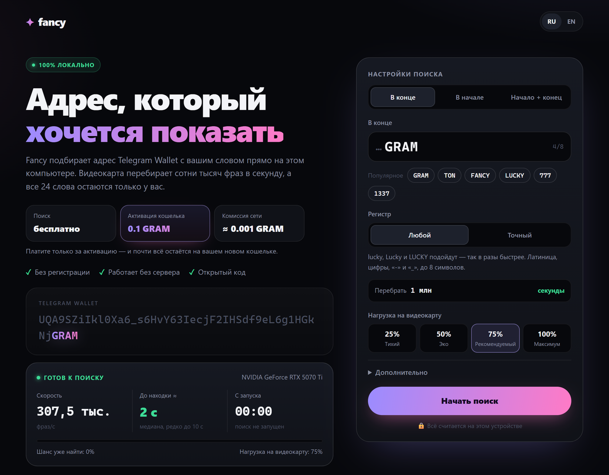
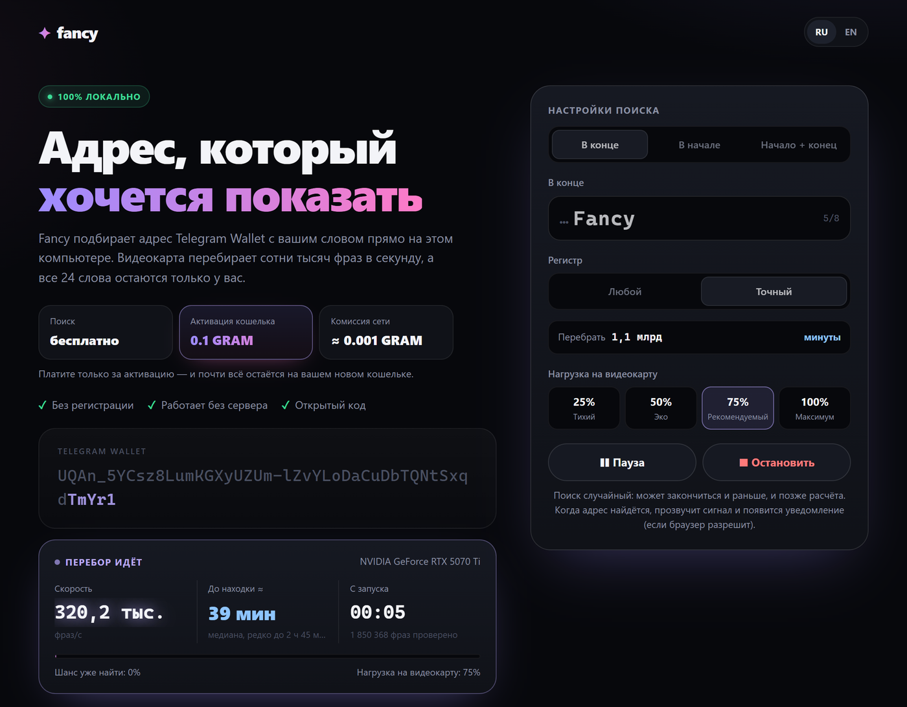
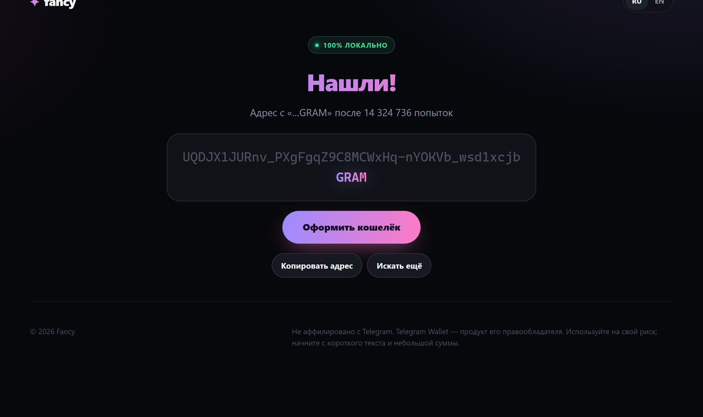

<div align="center">

# ✦ Fancy

**A free vanity address generator for Telegram Wallet.**
It runs on your GPU right in the browser — no server, no sign-up, open source.

### [⬇ Download Fancy.html](../../releases/latest)

[Русский](README.md) · [Telegram channel](https://t.me/blackwrites) · [How to use](#how-to-use) · [Security](#security--privacy) · [How it works](#how-it-works)



</div>

---

## What it is

A regular Telegram Wallet address is 48 random characters. Fancy finds one that contains **your word**:

| Mode | Example |
|---|---|
| At the end | `UQDJX1JURnv_PXgFgqZ9C8MCWxHq-nYOKVb_wsd1xcjb`**`GRAM`** |
| At the start | `UQ`**`Dog`**`A9SZk1kl0Xaj_f6BnzJ3IeccFPlHSd29e2Ug1HG…` |
| Start + end | `UQ`**`Dog`**`…`**`GRAM`** |

- **Your GPU does the work** — hundreds of thousands of candidates per second via WebGPU, right in a browser tab.
- **See the wait time instantly** — while you type, Fancy shows how long it will take on *your* computer.
- **All 24 words are created on your device.** Nobody else has them — not a server, not the author.
- **Free.** You only pay the network to activate the wallet: send **0.1 GRAM** to the new address, the fee is ≈ 0.001 GRAM and the rest stays in your wallet.

## How to use

1. Open [Releases](../../releases/latest) and download **`Fancy.html`**.
2. Double-click it to open in a recent **Chrome** or **Edge**. Fancy checks your GPU and measures its speed (up to 30 s on first launch).
3. Type your text: **at the end**, **at the start** or **both**. The left card shows the expected wait right away.
4. Press **"Start search"**. You can minimize the window; keep the tab open. You'll hear a signal when it's found.
5. **"Set up the wallet"** → write down **all 24 words** in order, on paper.
6. Send **0.1 GRAM** to the found address from any wallet and press **"Switch the key to my 24 words"**.
7. Telegram → **Wallet** → **"Import wallet"** → enter the 24 words. Done.

> **Tip:** start with short text (3–4 characters). You can practice on testnet: "Advanced" → "Network" → Testnet.

<p align="center">
  
  
</p>

## How long it takes

The search is random: half of the searches finish before the median, 1 in 20 takes about 4× longer. Each exact-case character multiplies the time by 64, any-case by ~32.

Median for a suffix on an **RTX 5070 Ti** at the recommended load (~325k phrases/s):

| Chars | Any case | Exact case |
|:-:|:-:|:-:|
| 3 | under a second | under a second |
| 4 | ~2 s | ~36 s |
| 5 | ~1 min | ~38 min |
| 6 | ~38 min | ~40 h |
| 7 | ~20 h | ~3–4 months |
| 8 | ~4 weeks | years |

Your device will differ — Fancy measures its speed and recalculates.

## Requirements

- **A browser with WebGPU:** Chrome or Edge 113+ on Windows, macOS or Linux (recent Safari/Firefox if WebGPU is enabled).
- **A GPU.** Without WebGPU the search won't start — Fancy tells you so.
- **Internet** is only needed for the key-switch step (balance check and sending the transaction).
- **Adjustable load:** 25 / 50 / 75 / 100 %. Default is 75 % — quieter and cooler, only slightly slower.

## Security & privacy

- **No server.** Fancy is a single HTML file; everything runs in your browser tab.
- **What goes over the network:** only during setup and only to public `toncenter.com` — the address (balance check) and the signed deploy + key-switch transaction. Words and private keys are never sent.
- **No other connections:** a Content-Security-Policy in the file restricts network access to `toncenter.com`.
- **Results are cross-checked:** before searching, the GPU and CPU compute the same phrases — any mismatch disables the GPU. Every hit is recomputed on the CPU.
- **The key is switched on-chain:** afterwards words 1–12 alone can sign nothing — a property of the contract, not a promise. The transaction is visible in any explorer.
- **Where the words live:** in your browser's `localStorage` until you delete the record. After importing into Wallet, delete it with "Delete".

### Verify the file

1. **Checksum.** The release contains `Fancy.html.sha256`:
   ```bash
   # Windows (PowerShell)
   Get-FileHash Fancy.html -Algorithm SHA256
   # macOS / Linux
   shasum -a 256 Fancy.html
   ```
2. **Built from this code.** Releases are built by GitHub Actions ([`.github/workflows/release.yml`](.github/workflows/release.yml)); the build log prints the same checksum.
3. **Build it yourself** (below) and compare.

Found a vulnerability? See [SECURITY.md](SECURITY.md).

## How it works

Telegram Wallet uses the [**WalletTg**](https://github.com/ton-blockchain/tg-wallet-contract) contract, whose key can be switched while the address stays the same. The 24-word phrase has two halves:

| Words | Source | Role |
|---|---|---|
| 1–12 | found by the search | BIP39 → PBKDF2-HMAC-SHA512 (2048) → SLIP-10 ed25519 `m/44'/607'/0'` → public key → WalletTg trampoline stateInit → **address** |
| 13–24 | created by your browser | the wallet's new key |

1. **Search.** Each GPU thread takes 128 bits of random entropy, builds 12 BIP39 words, runs PBKDF2 (≈4,100 SHA-512 blocks), SLIP-10, ed25519 and the address, and matches the pattern. Shader: [`src/miner/vanity.wgsl`](src/miner/vanity.wgsl).
2. **Activation.** One external message: `stateInit` (deploy) + `ChangePublicKeyRequestE` (`0xFBBA99C8`) signed by the words 1–12 key, with a `KEY_ROTATION` proof signed by the words 13–24 key.
3. **Import.** From the 24 words Telegram Wallet restores both the address (words 1–12) and the key (words 13–24).

The real activation fee is about 0.0007 GRAM (measured against the live contract bytecode in an emulator); 0.1 GRAM leaves a safe margin and the rest stays in the wallet.

## Build from source

Requires [Node.js](https://nodejs.org) 22+.

```bash
git clone <this repository URL>
cd fancy
npm ci
npm test          # cross-check against reference libraries + emulator with the live contract
npm run build     # → dist/index.html (this is Fancy.html)
```

Dev mode: `npm run dev` → http://127.0.0.1:5178.

## Repository layout

```
src/
  main.js              UI: home, live card, search, result, wallet setup
  style.css            styles
  ui/i18n.js           RU / EN strings
  core/fast.js         BIP39, PBKDF2, SLIP-10, ed25519, WalletTg address, patterns
  core/wallet.js       "deploy + switch key" message, toncenter client
  miner/vanity.wgsl    WebGPU shader: the whole search pipeline on the GPU
  miner/sha512-unrolled.js  unrolled SHA-512 for the PBKDF2 hot loop
  miner/gpu.js         shader driver, GPU ↔ CPU self-test, load control
test/
  derive.test.js       keys and addresses vs @scure/bip39, micro-key-producer, @ton/core
  sandbox.test.js      @ton/sandbox emulator with the live WalletTg bytecode (config-123.json)
.github/workflows/     checks and automated release
docs/                  README screenshots
```

## Disclaimer

Fancy is not affiliated with Telegram. Telegram Wallet is a product of its respective owner. The software is provided "as is", without warranty (see [LICENSE](LICENSE)). You are responsible for keeping your 24 words safe. Start with short text and a small amount.

## Credits

[ton-blockchain/tg-wallet-contract](https://github.com/ton-blockchain/tg-wallet-contract) · [@noble/hashes](https://github.com/paulmillr/noble-hashes) · [@noble/curves](https://github.com/paulmillr/noble-curves) · [@scure/bip39](https://github.com/paulmillr/scure-bip39) · [@ton/core](https://github.com/ton-org/ton-core) · [@ton/sandbox](https://github.com/ton-org/sandbox) · [Vite](https://vitejs.dev)

## Author

**@wtf_black** · Telegram channel: [@blackwrites](https://t.me/blackwrites) — Fancy news and other projects.

## License

[MIT](LICENSE) — free to use, modify and distribute.
